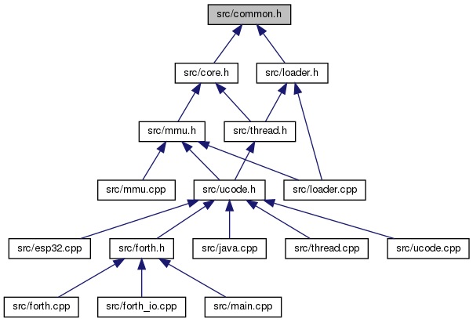

# nanoJVM
## JVM for microcontroller
TODO:
* dir - Java class file directory listing
* load - Load class file into separate "namespace" as Forth volcabularies

### docs


### src
|module|desc.|structs|
|---|---|---|
|common.h|setting and macros||
|core.h|common classes|List, Method, Word|
|thread.*|core thread (i.e. task) class|Thread|
|mmu.*|memory pool managemer|KV, Pool|
|loader.*|bytecode loader|Loader|
|java.*|java virtual machine| |
|forth.*|Forth words|uForth|
|forth_io.cpp|Forth IO functions| |
|ucode.*|JVM microcode unit|Ucode|
|esp32.cpp|ESP32 words|uESP32|
|main.cpp|main module| |
### tests
|case|methods|note|
|---|---|---|
|Hello|basic function call (in main)|words, clock, here, -=, -, ss|
|IfElesThen|conditional branch|if ( > ) else|
|ForLoop|for loop and benchmark|outer; for (int i=0; i<4; i++); clock|
|ForLoop2|for loop (2-d) and benchmark|clock|
|InstVar|class static, instance vars|new, clock, here, delay|
|NObj|create new objects with instance vars||
|ObjMethod|calling object method|new, clock|
|Outer|Forth outer interpreter loop|clock, dump, delay|
|Print|System.out.print, println||
|ESP32Test|ESP pin interfacing|pinMode, digitalWrite|
|Array01|Java array|a[], a.length|
|Array02|Java 2-d array|?a[][], 2-deep loops|

Use the following toolchain to produce bytecode (and analysis)
#### ej32 subdirectories
     * Forth - words/methods provided by Forth 
     * ESP32 - words/methods provided by ESP32

> javac -cp . -g:none InstVar.java

> javap -c -p InstVar.class

> od -A x -t x1z -v InstVar.class

> java -cp . InstVar

Example:
```
/home/gnii/devel/java/nanojvm/tests% ../Debug/nanojvm InstVar.class

Java class file: InstVar.class
0000: ca fe ba be  00 00 00 37  00 23 0a 00  0a 00 13 07  _______7_#______
0010: 00 14 0a 00  02 00 13 0a  00 15 00 16  09 00 02 00  ________________
0020: 17 0a 00 15  00 18 09 00  02 00 19 0a  00 15 00 1a  ________________
0030: 09 00 02 00  1b 07 00 1c  01 00 03 63  76 30 01 00  ___________cv0__
0040: 01 49 01 00  03 69 76 30  01 00 03 69  76 31 01 00  _I___iv0___iv1__
0050: 06 3c 69 6e  69 74 3e 01  00 03 28 29  56 01 00 04  _<init>___()V___
0060: 43 6f 64 65  01 00 04 6d  61 69 6e 0c  00 0f 00 10  Code___main_____
0070: 01 00 07 49  6e 73 74 56  61 72 07 00  1d 0c 00 1e  ___InstVar______
0080: 00 1f 0c 00  0e 00 0c 0c  00 20 00 1f  0c 00 0b 00  _________ ______
0090: 0c 0c 00 21  00 22 0c 00  0d 00 0c 01  00 10 6a 61  ___!_"________ja
00a0: 76 61 2f 6c  61 6e 67 2f  4f 62 6a 65  63 74 01 00  va/lang/Object__
00b0: 0a 65 6a 33  32 2f 46 6f  72 74 68 01  00 05 63 6c  _ej32/Forth___cl
00c0: 6f 63 6b 01  00 03 28 29  49 01 00 04  68 65 72 65  ock___()I___here
00d0: 01 00 05 64  65 6c 61 79  01 00 04 28  49 29 56 00  ___delay___(I)V_
00e0: 20 00 02 00  0a 00 00 00  03 00 08 00  0b 00 0c 00   _______________
00f0: 00 00 00 00  0d 00 0c 00  00 00 00 00  0e 00 0c 00  ________________
0100: 00 00 02 00  00 00 0f 00  10 00 01 00  11 00 00 00  ________________
0110: 11 00 01 00  01 00 00 00  05 2a b7 00  01 b1 00 00  _________*______
0120: 00 00 00 09  00 12 00 10  00 01 00 11  00 00 00 43  _______________C
0130: 00 03 00 02  00 00 00 37  bb 00 02 59  b7 00 03 4c  _______7___Y___L
0140: 2b b8 00 04  b5 00 05 b8  00 06 b3 00  07 11 01 f4  +_______________
0150: b8 00 08 2b  59 b4 00 05  b8 00 04 64  b5 00 05 2b  ___+Y______d___+
0160: 2b b4 00 05  74 5a b5 00  09 3b 1a b3  00 07 b1 00  +___tZ___;______
0170: 00 00 00 00  00 ff ff ff  ff ff ff ff  ff ff ff ff  ________________
[01]000a:0a=>[a,13]
[02]000f:07=>14
[03]0012:0a=>[2,13]
[04]0017:0a=>[15,16]
[05]001c:09=>[2,17]
[06]0021:0a=>[15,18]
[07]0026:09=>[2,19]
[08]002b:0a=>[15,1a]
[09]0030:09=>[2,1b]
[0a]0035:07=>1c
[0b]0038:01=>cv0
[0c]003e:01=>I
[0d]0042:01=>iv0
[0e]0048:01=>iv1
[0f]004e:01=><init>
[10]0057:01=>()V
[11]005d:01=>Code
[12]0064:01=>main
[13]006b:0c=>[f,10]
[14]0070:01=>InstVar
[15]007a:07=>1d
[16]007d:0c=>[1e,1f]
[17]0082:0c=>[e,c]
[18]0087:0c=>[20,1f]
[19]008c:0c=>[b,c]
[1a]0091:0c=>[21,22]
[1b]0096:0c=>[d,c]
[1c]009b:01=>java/lang/Object
[1d]00ae:01=>ej32/Forth
[1e]00bb:01=>clock
[1f]00c3:01=>()I
[20]00c9:01=>here
[21]00d0:01=>delay
[22]00d8:01=>(I)V
class [2]InstVar : [a]java/lang/Object
  p_intf=e7, p_attr=e9
  sz_cls=4, sz_inst=8
  n_method=2, p_method=103
  [0f]<init>()V (5 bytes)
  [12]main()V (37 bytes)
} loaded.

eJ32 v1 staring...

main() <-1|0 0> ok
j0138:bb new InstVar <-1|0 0 4> ok
j013b:59 dup <-1|0 0 4 4> ok
j013c:b7 invokespecial InstVar.<init>:()V $0 <-1 0 0 4|4> ok
j0119:2a aload_0 <-1 0 0 4|4 4> ok
j011a:b7 invokespecial java/lang/Object.<init>:()V $1 <-1 0 0 4|4> ok
j011d:b1 return <-1|0 0 4> ok
j013f:4c astore_1 <-1|0 4> ok
j0140:2b aload_1 <-1|0 4 4> ok
j0141:b8 invokestatic ej32/Forth.clock:()I $2 <-1|0 4 4 486461788> ok
j0144:b5 putfield InstVar.iv1:I $0 <-1|0 4> ok
j0147:b8 invokestatic ej32/Forth.here:()I $3 <-1|0 4 5562> ok
j014a:b3 putstatic InstVar.cv0:I $0 <-1|0 4> ok
j014d:11 sipush <-1|0 4 500> ok
j0150:b8 invokestatic ej32/Forth.delay:(I)V $4 **NA** <-1|0 4 500> ok
j0153:2b aload_1 <-1|0 4 500 4> ok
j0154:59 dup <-1|0 4 500 4 4> ok
j0155:b4 getfield $0 <-1|0 4 500 4 486461788> ok
j0158:b8 invokestatic $2 clock <-1|0 4 500 4 486461788 486461789> ok
j015b:64 isub <-1|0 4 500 4 -1> ok
j015c:b5 putfield $0 <-1|0 4 500> ok
j015f:2b aload_1 <-1|0 4 500 4> ok
j0160:2b aload_1 <-1|0 4 500 4 4> ok
j0161:b4 getfield $0 <-1|0 4 500 4 -1> ok
j0164:74 ineg <-1|0 4 500 4 1> ok
j0165:5a dup_x1 <-1|0 4 500 1 4 1> ok
j0166:b5 putfield InstVar.iv0:I $1 <-1|0 4 500 1> ok
j0169:3b istore_0 <-1|1 4 500> ok
j016a:1a iload_0 <-1|1 4 500 1> ok
j016b:b3 putstatic $0 <-1|1 4 500> ok
j016e:b1 return

eJ32 done.
```
